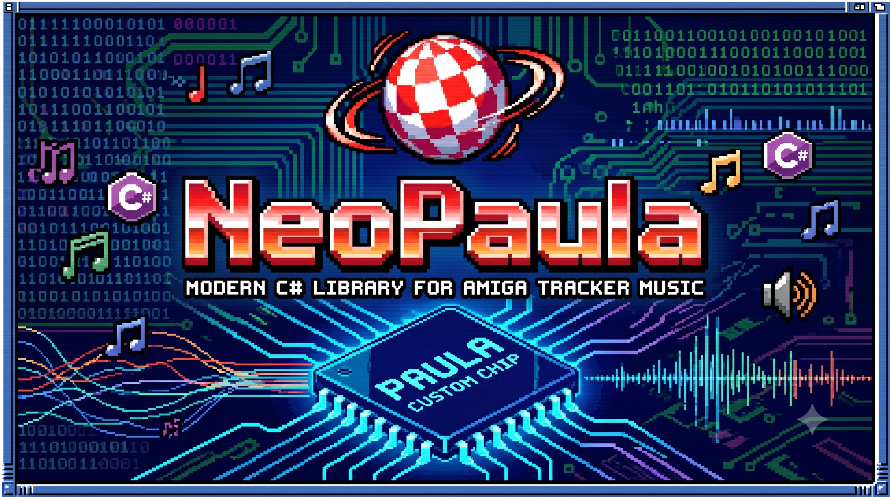

**NeoPaula** is a modern C# library for playing old school Amiga Protracker / Noisetracker `.mod` music files as well as OctaMED `.mmd` files.

## Features

- Uses the robust [NAudio](https://github.com/naudio/NAudio) library for sound playback.
- Returns basic metainformation about a track without playing (e.g. format, title, channels).
- Seamlessly plays from either a `Stream` or a `filename`.
- Autodetects tracker format from magics directly in streams.

## Getting Started

### Indexing a Folder of Tracks

You can fetch track info (Title, Channels, Format) without playing the entire file, perfect for building music libraries or indices.

```csharp
using System.IO;
using NeoPaula;

var player = new NeoPaulaPlayer();

foreach (var file in Directory.GetFiles("./music", "*.*"))
{
    var info = player.GetTrackInfo(file);
    Console.WriteLine($"Found {info.Format} track: {info.Title} with {info.Channels} channels");
}
```

### Playback from Filename or Stream

```csharp
using NeoPaula;

using (var player = new NeoPaulaPlayer())
{
    // Play directly from a file
    player.Play("my_amiga_tune.mod");

    // Or play from a stream!
    // var stream = File.OpenRead("my_octamed_tune.mmd");
    // player.Play(stream);

    Console.WriteLine("Playing... Press any key to stop.");
    Console.ReadKey();
}
```

## Contributing

Contributions, issues, and feature requests are welcome!

## License

[MIT](LICENSE)
